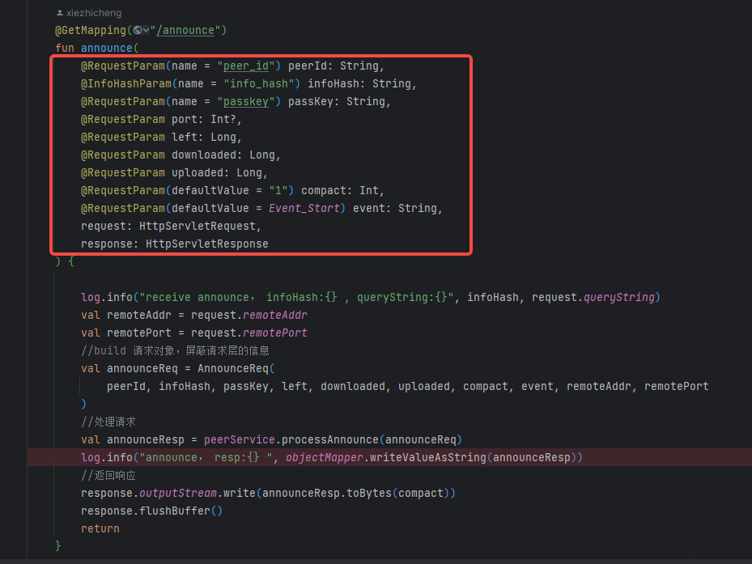
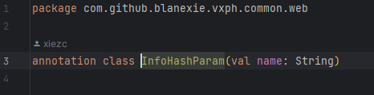
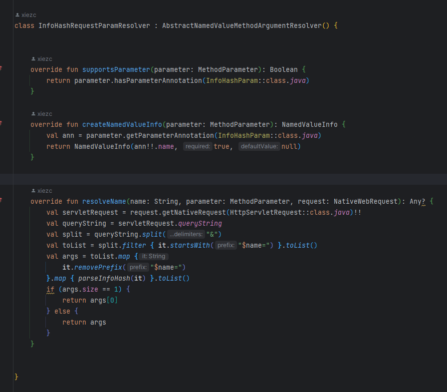
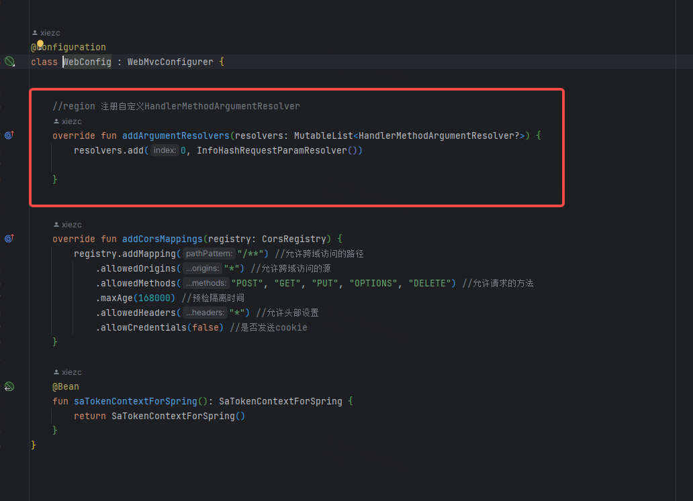
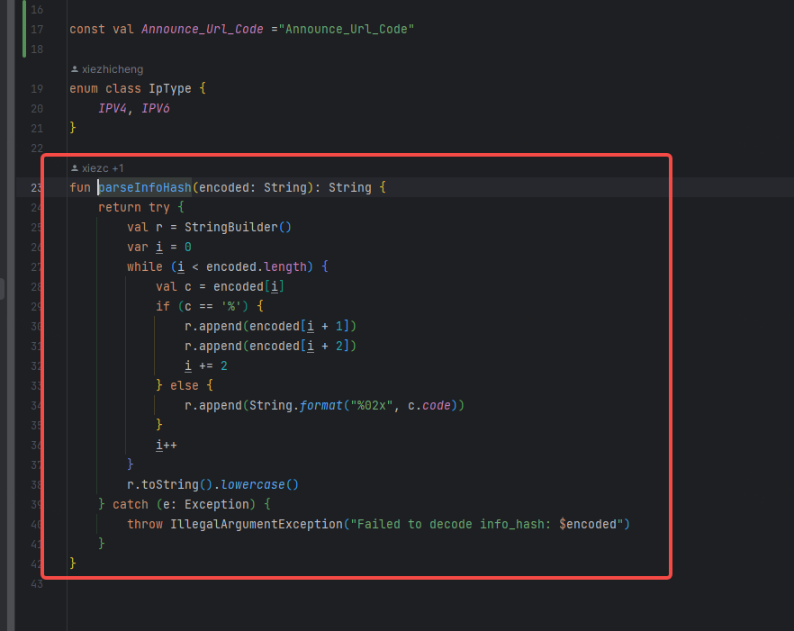

# Torrent文件分析

bep003 协议是BT协议族的最基础协议。 本篇先讲述下这个协议的内容， 在描述下本项目是怎么实现这个协议的。 

* 协议地址： https://www.bittorrent.org/beps/bep_0003.html

## Bencode 编码
Torrent文件和所有的BT协议中的内容都是使用这个编码的。 具体详细可以百度了解下

协议中的简单描述： 
* 字符串是以长度为前缀的十进制，后跟冒号和字符串。例如，4：spam 对应于“spam”。
* 整数由“i”表示，后跟以 10 为基数的数字 后跟“e”。例如，i3e 对应于 3，i-3e 对应于 -3。整数没有大小 限度。i-0e 无效。所有带有前导的编码 零，比如 i03e，是无效的，除了 i0e，当然对应于 0。
* 列表被编码为“l”，后跟其元素（也 bencoded），后跟“e”。例如，l4：spam4：eggse 对应于 ['spam'， 'eggs']。
* 字典编码为“d”，后跟交替列表 键及其相应的值，后跟“e”。例如，d3：cow3：moo4：spam4：eggse 对应于 {'cow'： 'moo'， 'spam'： 'eggs'} 和 d4：spaml1：a1：bee 对应于 {'spam'： ['a'， 'b']}。键必须是字符串，并按排序顺序显示 （按原始字符串排序，而不是字母数字）。

> * 关于字符串的字符集， 十分混乱。 建议还是使用`ISO_8859_1`进行编码， 中文也是先转成字节数组，在使用这个字符集编码
> * 字节数组的编码，协议中也没有说明， 不过通用的还是先用`ISO_8859_1`编码成字符串，在使用bencode编码

## metainfo files  文件结构

文件结构分两种， 单文件结构和多文件结构
> bep003中定义的内容比较少，但是下面的树形结构中内容很多， 多余的内容不用管，都是后面补充协议加上去的

### 多文件Torrent的结构

├─announce：Tracker的主服务器
├─announce-list：Tracker服务器列表
├─comment：种子文件的注释
├─comment.utf-8：种子文件注释的utf-8编码
├─creation date：种子文件建立的时间，是从1970年1月1日00:00:00到现在的秒数。
├─encoding：种子文件的默认编码，比如GB2312，Big5，utf-8等
├─info：所有关于下载的文件的信息
│ ├─files：表示文件的名字
│ │ ├─length：文件的大小（Byte）
│ │ ├─path：文件的名字，在下载时不可更改
│ │ └─path.utf-8：文件名的UTF-8编码，同上
│ ├─name：推荐的文件夹名，此项可于下载时更改
│ ├─name.utf-8：推荐的文件夹名的utf-8编码，同上
│ ├─piece length：每个文件块的大小（Byte）
│ ├─pieces：文件的特征信息（将所有文件按照piece length的字节大小分成块，每块计算一个SHA1值，然后将这些值连接起来所组成）
│ ├─publisher：文件发布者的名字
│ ├─publisher-url：文件发布者的网址
│ ├─publisher-url.utf-8：文件发布者网址的utf-8编码
│ └─publisher.utf-8：文件发布者的名字的utf-8编码
└─nodes：这个字段包含一系列ip和相应端口的列表，是用于连接DHT初始node

### 单文件Torrent的结构
├─announce：Tracker的主服务器
├─announce-list：Tracker服务器列表
├─comment：种子文件的注释
├─comment.utf-8：种子文件注释的utf-8编码
├─creation date：种子文件建立的时间，是从1970年1月1日00:00:00到现在的秒数。
├─encoding：种子文件的默认编码，比如GB2312，Big5，utf-8等
├─info：所有关于下载的文件的信息
│ ├─length：文件的大小（Byte）
│ ├─name：推荐的文件夹名，此项可于下载时更改
│ ├─name.utf-8：推荐的文件夹名的utf-8编码，同上
│ ├─piece length：每个文件块的大小（Byte）
│ ├─pieces：文件的特征信息（将所有文件按照piece length的字节大小分成块，每块计算一个SHA1值，然后将这些值连接起来所组成）
│ ├─publisher：文件发布者的名字
│ ├─publisher-url：文件发布者的网址
│ ├─publisher-url.utf-8：文件发布者网址的utf-8编码
│ └─publisher.utf-8：文件发布者的名字的utf-8编码
└─nodes：这个字段包含一系列ip和相应端口的列表，是用于连接DHT初始node

## Tracker  下载客户端上报
Tracker可以理解成BT的注册中心， 它记录各个下载客户端信息的服务， 
各个客户端也可以从tracker中获取其他下载或者做种的用户。 

客户端一般都是使用HTTP GET 请求来上报给tracker信息。 上报的参数如下： 

* info_hash – 这是 .torrent 文件的 info 段的 SHA-1 哈希值，它是个经过 URL 编码的二进制字符串
* peer_id – 由客户端自行生成的唯一随机 ID，由于在 BT 网络中区分不同的客户端，部分客户端的 peer_id 可能包含不可读字符
* uploaded – 代表本次会话期间，客户端一共上传了多少字节
* downloaded – 代表本次会话期间，客户端一共下载了多少字节
* left – 代表客户端还剩余多少字节等待下载（注意：由于存在校验环节，left 字段仅供参考）
* event – 代表该 torrent 的事件, 可选字段。  事件列表 :
  * started 种子开始下载
  * completed 种子下载完成，开始做种
  * stopped 种子停止下载 / 做种，不再活动
  * empty 和没有此字段的情况完全相同

> 约定俗成的请求路径为 /announce , 下面是一个真实请求示例：  示例中包含有很多其他的字段，不用管都是BT其他协议引入的 
> * `GET /announce?info_hash=j%25%7c%fe%12%0e%c0%9d%ee6%d5%df%03%bb%fda%cd%7b%97%b5&peer_id=-qB4510-1MTFo0SteXN2&port=22387&uploaded=0&downloaded=0&left=0&corrupt=0&key=332CA113&event=started&numwant=200&compact=1&no_peer_id=1&supportcrypto=1&redundant=0&ipv4=198.18.0.1&ipv6=2408%3a8214%3a2e11%3a8cb1%3a%3a9b8&ipv6=2408%3a8214%3a2e11%3a8cb1%3a7c27%3acac2%3a3b51%3a42fb&ipv6=2408%3a8214%3a2e11%3a8cb1%3ae0e7%3a8eb%3a4677%3a21f0`

## 后端接收Announce上报接口

### InfoHashParam注解 
由于infoHash是一个20长度的字节数组， Qbitorrent客户端上报的infoHash字段中，SpringBoot的默认参数解析无法正确接码， 
于是我自定义了接口参数注解和解析方式。 

* `InfoHashParam` 注解定义

* `InfoHashRequestParamResolver` 参数解析类

* 装配到Spring框架中

* infoHash解码

